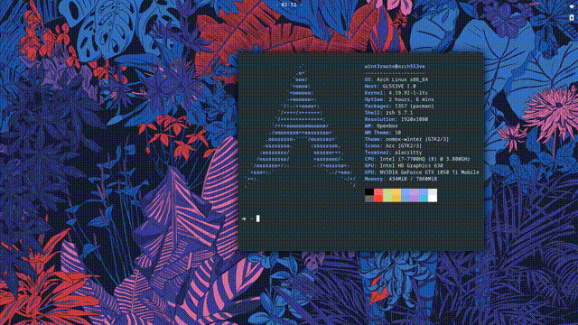

# One-shot window tiling/aligning program

So I wanted nice window layouts without having to bother with tiling WMs (I love my Openbox setup way too much).
Zentile just wasn't right for me (it stays on as a background process all the time,
makes you move your tiling-dedicated keyboard shortcuts into a separate file).

Tiler is a "one-shot" script type - you bind it into a keyboard shortcut,
then activate it when you want to align your windows.

## Usage

Tiler will automatically align all windows in your workspace.

`tiler` - standard settings ( *a e s t h e t i c* )

`tiler small` - smaller gaps, bigger windows, practical

## What works

Tldr; just watch this

Currently there are layouts for:

* 1 window - aligns the window to the center, switches between small and big window size
* 2 windows - side-by-side, windows are swapped each time you activate Tiler, use `big` option to get bigger windows
* 3 windows - One big window on the left, 2 smaller windows on the right, moves windows CCW on activation

## Installation

### AUR

[tiler-bin](https://aur.archlinux.org/packages/tiler-bin/) AUR package

### Manual

* Clone the repo
* `cargo build --release`
* Copy the resulting binary from `target/release/tiler` into some convenient place
* Bind the binary execution to your keyboard shortcut of choice
